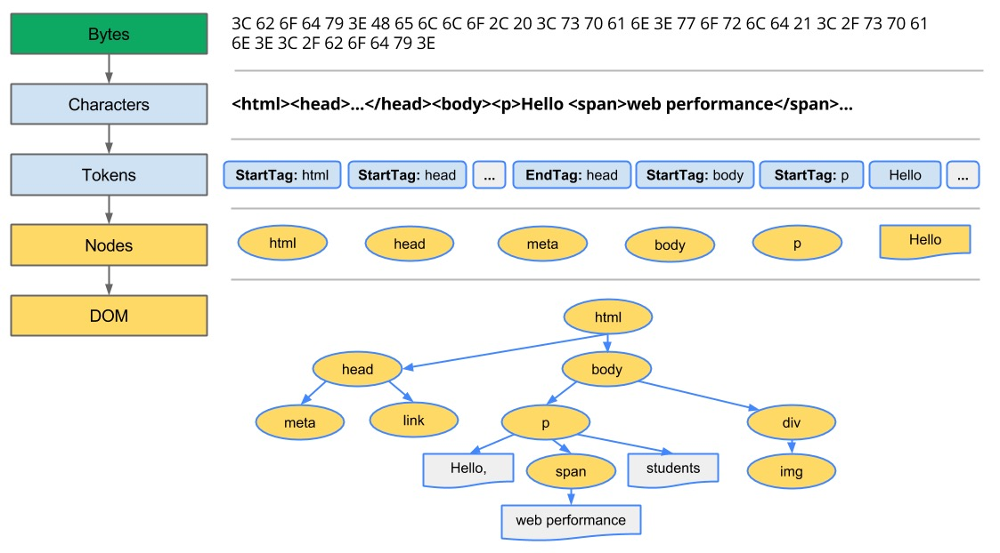
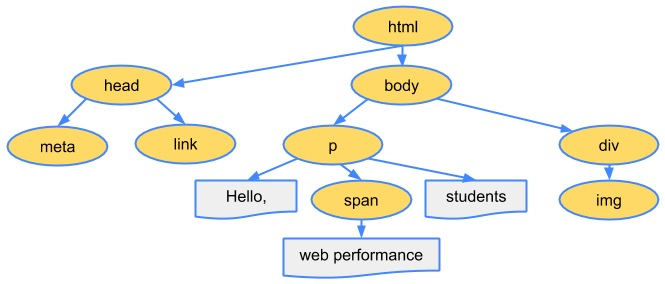
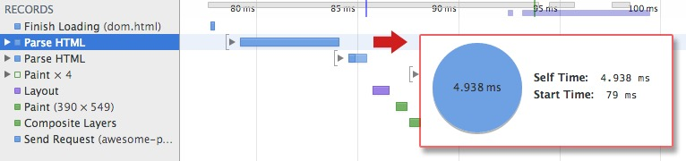
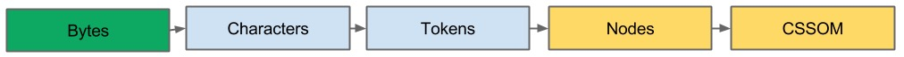
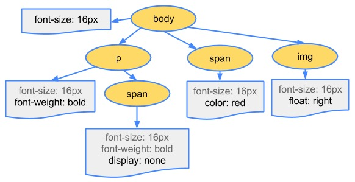
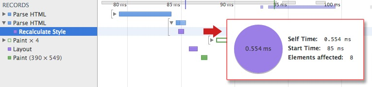
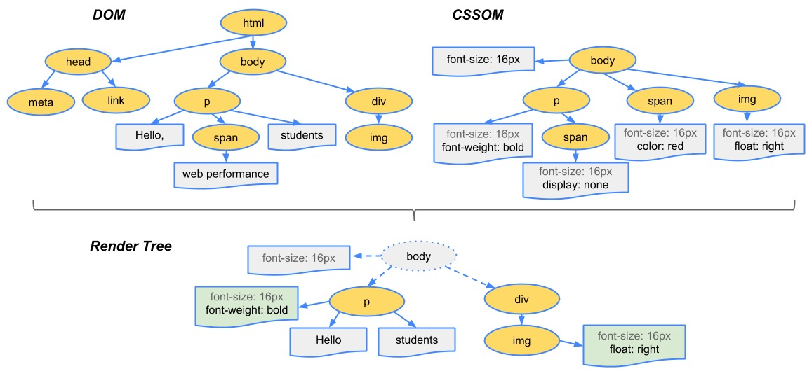
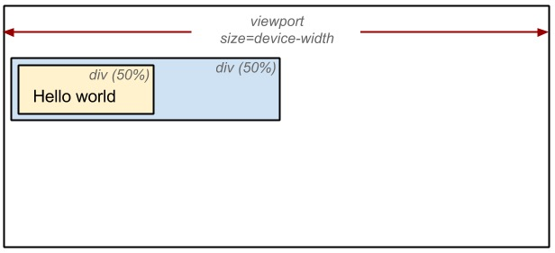
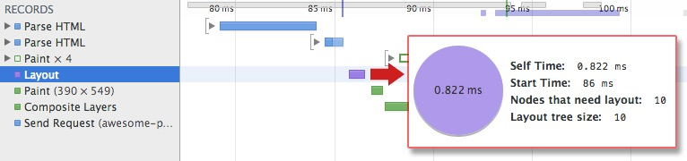

# 浏览器渲染页面前需要先构建 DOM 和 CSSOM 树

* 字节 → 字符 → 令牌 → 节点 → 对象模型。
* HTML 标记转换成文档对象模型 (DOM)；CSS 标记转换成 CSS 对象模型 (CSSOM)。
* DOM 和 CSSOM 是独立的数据结构。
* Chrome DevTools Timeline 让我们可以捕获和检查 DOM 和 CSSOM 的构建和处理开销。

## 文档对象模型（DOM）

```
<html>
  <head>
    <meta name="viewport" content="width=device-width,initial-scale=1">
    <link href="style.css" rel="stylesheet">
    <title>Critical Path</title>
  </head>
  <body>
    <p>Hello <span>web performance</span> students!</p>
    <div></div>
  </body>
</html>

```
浏览器的处理过程如下


1. **转换：** 浏览器从磁盘或者网络读取HTML的原始字节，并根据文件的指定编码（例如UTF-8）将它们转换成各个字符。
2. **令牌化：** 浏览器将字符串转换成 W3C HTML5标准规定的各种令牌，例如：<html>,<body>，以及其他街括号内的字符串。每个令牌都具有特殊的含义和一组规则。
3. **词法分析：** 发出的令牌转换成定义其属性和规则的对象
4. **DOM构建：** 最后，由于 HTML 标记定义不同标记之间的关系（一些标记包含在其他标记内），创建的对象链接在一个树数据结构内，此结构也会捕获原始标记中定义的父项-子项关系：HTML 对象是 body 对象的父项，body 是 paragraph 对象的父项，依此类推。



**整个流程的最终输出是我们这个简单页面的文档对象模型 (DOM)，浏览器对页面进行的所有进一步处理都会用到它**

浏览器每次处理 HTML 标记时，都会完成以上所有步骤：将字节转换成字符，确定令牌，将令牌转换成节点，然后构建 DOM 树。这整个流程可能需要一些时间才能完成，有大量 HTML 需要处理时更是如此。



如果您打开 Chrome DevTools 并在页面加载时记录时间线，就可以看到执行该步骤实际花费的时间。在上例中，将一堆 HTML 字节转换成 DOM 树大约需要 5 毫秒。对于较大的页面，这一过程需要的时间可能会显著增加。创建流畅动画时，如果浏览器需要处理大量 HTML，这很容易成为瓶颈.

DOM 树捕获文档标记的属性和关系，但并未告诉我们元素在渲染后呈现的外观。那是 CSSOM 的责任。


## CSS 对象模型 (CSSOM)

在浏览器构建我们这个简单页面的 DOM 时，在文档的 head 部分遇到了一个 link 标记，该标记引用一个外部 CSS 样式表：style.css。由于预见到需要利用该资源来渲染页面，它会立即发出对该资源的请求，并返回以下内容：

```
body { font-size: 16px }
p { font-weight: bold }
span { color: red }
p span { display: none }
img { float: right }

```
与处理 HTML 时一样，我们需要将收到的 CSS 规则转换成某种浏览器能够理解和处理的东西。因此，我们会重复 HTML 过程，不过是为 CSS 而不是 HTML：


CSS 字节转换成字符，接着转换成令牌和节点，最后链接到一个称为“CSS 对象模型”(CSSOM) 的树结构内：


CSSOM 为何具有树结构？为页面上的任何对象计算最后一组样式时，浏览器都会先从适用于该节点的最通用规则开始（例如，如果该节点是 body 元素的子项，则应用所有 body 样式），然后通过应用更具体的规则（即规则“向下级联”）以递归方式优化计算的样式。

以上树并非完整的 CSSOM 树，它只显示了我们决定在样式表中替换的样式。每个浏览器都提供一组默认样式（也称为“User Agent 样式”），即我们不提供任何自定义样式时所看到的样式，我们的样式只是替换这些默认样式

要了解 CSS 处理所需的时间，您可以在 DevTools 中记录时间线并寻找“Recalculate Style”事件：与 DOM 解析不同，该时间线不显示单独的“Parse CSS”条目，而是在这一个事件下一同捕获解析和 CSSOM 树构建，以及计算的样式的递归计算。



# 渲染树构建、布局及绘制

CSSOM 树和 DOM 树合并成渲染树，然后用于计算每个可见元素的布局，并输出给绘制流程，将像素渲染到屏幕上。优化上述每一个步骤对实现最佳渲染性能至关重要。

* DOM 树与 CSSOM 树合并后形成渲染树。
* 渲染树只包含渲染网页所需的节点。
* 布局计算每个对象的精确位置和大小。
* 最后一步是绘制，使用最终渲染树将像素渲染到屏幕上。

第一步是让浏览器将 DOM 和 CSSOM 合并成一个“渲染树”，网罗网页上所有**可见**的 DOM 内容，以及每个节点的所有 CSSOM 样式信息。


为构建渲染树，浏览器大体上完成了下列工作：

1. 从 DOM 树的根节点开始遍历每个**可见**节点。
   * 某些节点不可见（例如脚本标记、元标记等），因为它们不会体现在渲染输出中，所以会被忽略。
   * 某些节点通过 CSS 隐藏，因此在渲染树中也会被忽略，例如，上例中的 span 节点---不会出现在渲染树中，---因为有一个显式规则在该节点上设置了“display: none”属性。
2. 对于每个可见节点，为其找到适配的 CSSOM 规则并应用它们。
3. 发射可见节点，连同其内容和计算的样式。

注：简单提一句，请注意 visibility: hidden 与 display: none 是不一样的。前者隐藏元素，但元素仍占据着布局空间（即将其渲染成一个空框），而后者 (display: none) 将元素从渲染树中完全移除，元素既不可见，也不是布局的组成部分。

最终输出的渲染同时包含了屏幕上的所有可见内容及其样式信息。有了渲染树，我们就可以进入“布局”阶段。
为弄清每个对象在网页上的确切大小和位置，浏览器从渲染树的根节点开始进行遍历。让我们考虑下面这样一个简单的实例：

```
<html>
  <head>
    <meta name="viewport" content="width=device-width,initial-scale=1">
    <title>Critial Path: Hello world!</title>
  </head>
  <body>
    <div style="width: 50%">
      <div style="width: 50%">Hello world!</div>
    </div>
  </body>
</html>
```

以上网页的正文包含两个嵌套 div：第一个（父）div 将节点的显示尺寸设置为视口宽度的 50%，---父 div 包含的第二个 div---将其宽度设置为其父项的 50%；即视口宽度的 25%。



布局流程的输出是一个“盒模型”，它会精确地捕获每个元素在视口内的确切位置和尺寸：所有相对测量值都转换为屏幕上的**绝对像素**。
最后，既然我们知道了哪些节点可见、它们的计算样式以及几何信息，我们终于可以将这些信息传递给最后一个阶段：将渲染树中的每个节点转换成屏幕上的实际像素。这一步通常称为“绘制”或“栅格化”。
上述步骤都需要浏览器完成大量工作，所以相当耗时。不过，Chrome DevTools 可以帮助我们对上述所有三个阶段进行深入的了解。让我们看一下最初“hello world”示例的布局阶段：



* “Layout”事件在时间线中捕获渲染树构建以及位置和尺寸计算。
* 布局完成后，浏览器会立即发出“Paint Setup”和“Paint”事件，将渲染树转换成屏幕上的像素。
执行渲染树构建、布局和绘制所需的时间将取决于文档大小、应用的样式，以及运行文档的设备：文档越大，浏览器需要完成的工作就越多；样式越复杂，绘制需要的时间就越长（例如，单色的绘制开销“较小”，而阴影的计算和渲染开销则要“大得多”）。


### 最后简要概述浏览器完成的步骤

1. 处理 HTML 标记并构建 DOM 树。
2. 处理 CSS 标记并构建 CSSOM 树。
3. 将 DOM 与 CSSOM 合并成一个渲染树。
4. 根据渲染树来布局，以计算每个节点的几何信息。
5. 将各个节点绘制到屏幕上。
